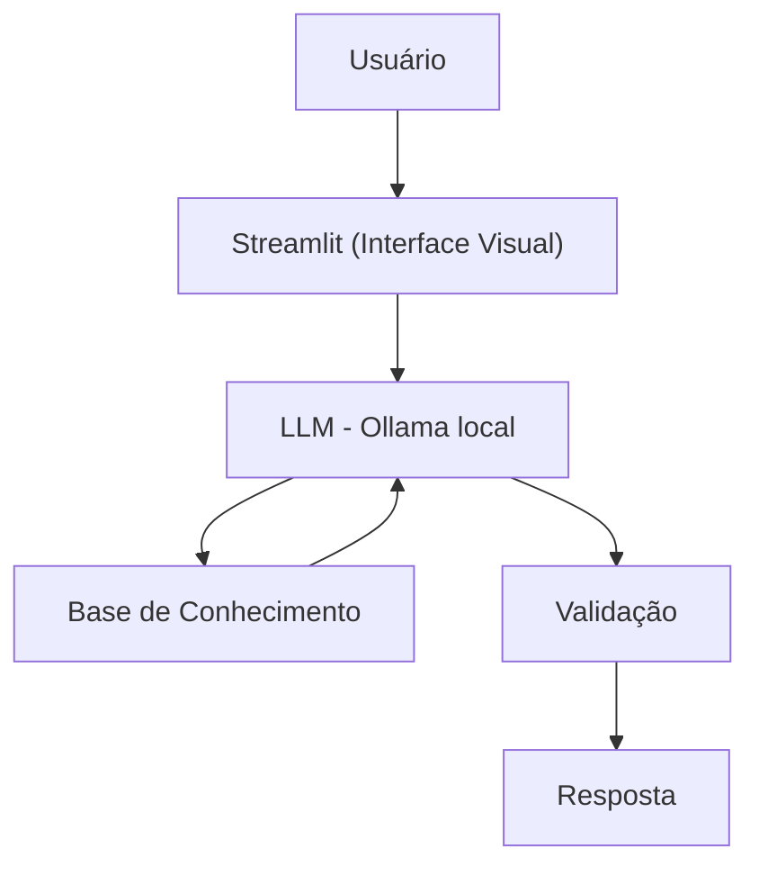

# 🎓 Beta — Educadora Financeira

Agente de IA Generativa que ensina finanças pessoais de forma simples e didática, usando os dados reais do próprio cliente como exemplo prático — **sem nunca recomendar investimentos específicos**.

Projeto final do módulo GenAI, Dados & Cyber — Bootcamp DIO/Bradesco.

---

## 🎯 Proposta

- **Problema:** muitas pessoas têm dificuldade em entender conceitos básicos de finanças pessoais (reserva de emergência, tipos de investimento, organização de gastos).
- **Solução:** a Beta explica esses conceitos usando o histórico financeiro do próprio usuário como exemplo, sem julgamento e sem aconselhar onde investir.
- **Público-alvo:** iniciantes em finanças pessoais que querem aprender a organizar sua vida financeira.

---

## 🧠 Persona

| | |
|---|---|
| **Nome** | Beta |
| **Personalidade** | Educativa, paciente, usa exemplos práticos e nunca julga os gastos do cliente |
| **Tom** | Informal, acessível e didático — como um professor particular |

> *"Olá! Sou a Beta, sua educadora financeira, como posso te ajudar a aprender hoje?"*

---

## 🏗️ Arquitetura



| Componente | Tecnologia |
|---|---|
| Interface | [Streamlit](https://streamlit.io/) |
| LLM | [Ollama](https://ollama.com/) (execução local, modelo `gpt-oss`) |
| Base de Conhecimento | JSON/CSV mockados em `src/data/` |
| Linguagem | Python (`pandas`, `requests`, `streamlit`) |

---

## 🚫 Regras e Anti-Alucinação

- Nunca recomenda investimentos específicos — apenas explica como funcionam.
- Não responde a perguntas fora do tema de educação financeira.
- Usa apenas os dados fornecidos no contexto.
- Admite quando não sabe algo, em vez de inventar uma resposta.
- Não acessa dados sensíveis (senhas, dados de outros clientes).
- Não substitui um profissional certificado.

---

## 📁 Estrutura do Projeto
```
MODULO07_PROJETO_FINAL/
├──📄 README.md
├──📁 docs/                       # Documentação do projeto
│   ├── 01-documentacao-agente.md   # Caso de uso, persona e arquitetura
│   ├── 02-base-conhecimento.md     # Estratégia e formatação dos dados
│   ├── 03-prompts.md               # System prompt, exemplos e edge cases
│   ├── 04-metricas.md              # Cenários de teste e avaliação
│   └── 05-pitch.md                 # Roteiro do pitch
└── src/
    ├──📄 app.py                    # Aplicação principal (Streamlit)
    ├──📓 app.ipynb                 # Mesma aplicação em Jupyter Notebook
    └──📁 data/                     # Dados mockados (cliente fictício)
        ├── perfil_investidor.json    # Perfil e metas do cliente
        ├── transacoes.csv            # Histórico de transações
        ├── historico_atendimento.csv # Atendimentos anteriores
        └── produtos_financeiros.json # Produtos disponíveis para ensino
```

---

## ▶️ Como Executar

**1. Instale as dependências:**
```bash
pip install streamlit pandas requests
```

**2. Instale e configure o Ollama** (execução local do LLM):
```bash
# Baixe o Ollama em https://ollama.com
ollama pull gpt-oss
ollama run gpt-oss "Olá!"   # teste rápido
```

**3. Rode a aplicação:**
```bash
# Como Rodar A Aplicação Usando o Terminal:
1) Abra o PowerShell ou Terminal.
2) Navegue até a pasta onde o arquivo app.py está salvo.
3) Digite o comando a seguir para abrir a aplicação:
streamlit run app.py

# Como Rodar A Aplicação Usando o Jupyter Notebook:
1) Abra o Jupyter Notebook na pasta onde o arquivo app.ipynb se encontra.
2) Abra o arquivo app.ipynb do Jupyter Notebook e rode as células até aparecer a aplicação.
```

---

## 🧪 Avaliação

O agente foi validado com cenários de teste cobrindo assertividade, segurança (anti-alucinação) e coerência das respostas — detalhes em [`docs/04-metricas.md`](./docs/04-metricas.md).

**Resultados observados:**
- ✅ Boa precisão nas respostas dentro do escopo de teste.
- ✅ Execução local viável, sem dependência de APIs externas.
- ⚠️ Latência elevada por limitação de hardware local — recomenda-se GPU dedicada ou migração para nuvem/API em cenários de maior escala.

---

## 📚 Documentação Completa

Toda a construção do agente — caso de uso, engenharia de prompts, base de conhecimento e métricas — está documentada em [`docs/`](./docs).

---

## 👤 Autor

Desenvolvido por **Marcio R. do Nascimento** — Bootcamp DIO/Bradesco, GenAI, Dados & Cyber 2026.
