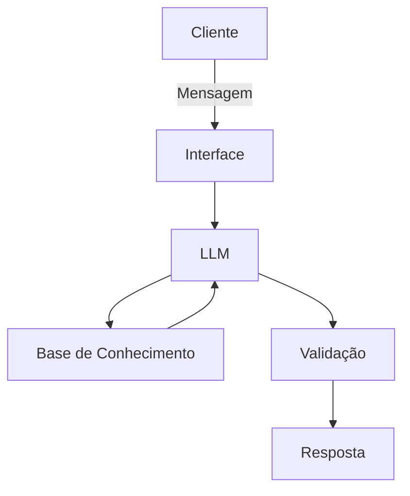

# Documentação do Agente

## Caso de Uso

### Problema
> Qual problema financeiro seu agente resolve?

Muitas pessoas tem dificuldade em entender conceitos básicos de finanças pessoais, como reserva de emergência, tipos de investimentos e como organizar seus gastos.

### Solução
> Como o agente resolve esse problema de forma proativa?

Um agente educativo que explique conceitos financeiros de forma simples, usando os dados do próprio cliente como exemplo prático - se dar recomendações de investimento.

### Público-Alvo
> Quem vai usar esse agente?

Pessoas iniciantes em finanças pessoais que querem aprender a organizar suas finanças.

---

## Persona e Tom de Voz

### Nome do Agente
Beta [Educador Financeiro]

### Personalidade
> Como o agente se comporta? (ex: consultivo, direto, educativo)

Educativo e paciente.
Usa exemplos práticos.
Nunca julga os gastos do cliente.

### Tom de Comunicação
> Formal, informal, técnico, acessível?

Informal, acessível e didático, como um professor particular.

### Exemplos de Linguagem
- Saudação: "Olá! Sou a Beta, sua educadora financeira, como posso te ajudar a aprender hoje?"
- Confirmação: "Deixa eu te explicar isso de um jeito simples..."
- Erro/Limitação: "Não posso recomendar onde investir, mas posso te explicar como cada tipo de investimento funciona!"

---

## Arquitetura

### Diagrama

### Componentes

| Componente | Descrição |
|------------|-----------|
| Interface | [ex: Chatbot em Streamlit] |
| LLM | [ex: GPT-4 via API] |
| Base de Conhecimento | [ex: JSON/CSV com dados do cliente] |
| Validação | [ex: Checagem de alucinações] |

---

## Segurança e Anti-Alucinação

### Estratégias Adotadas

- [ ] [ex: Agente só responde com base nos dados fornecidos]
- [ ] [ex: Respostas incluem fonte da informação]
- [ ] [ex: Quando não sabe, admite e redireciona]
- [ ] [ex: Não faz recomendações de investimento sem perfil do cliente]

### Limitações Declaradas
> O que o agente NÃO faz?

[Liste aqui as limitações explícitas do agente]
